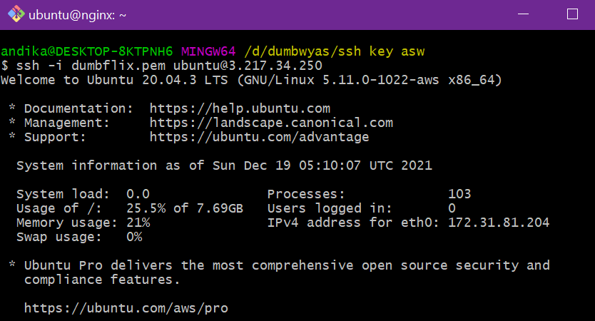
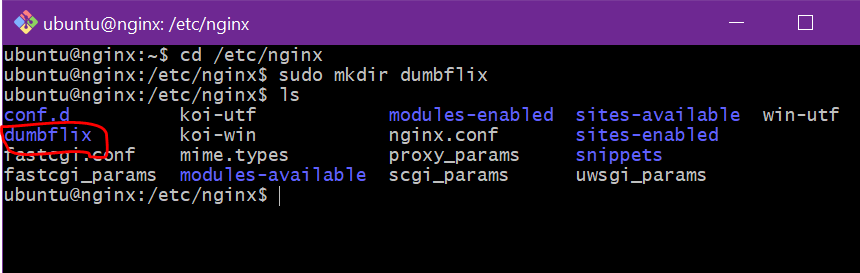
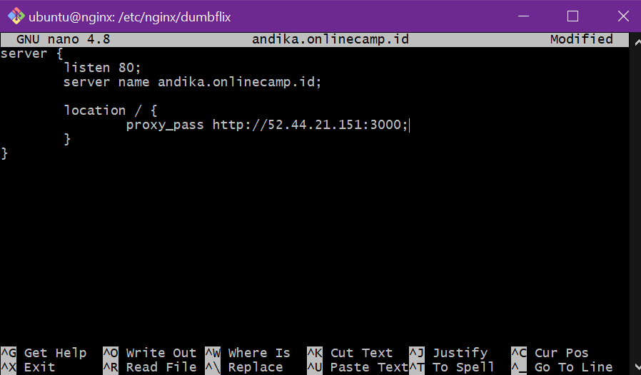
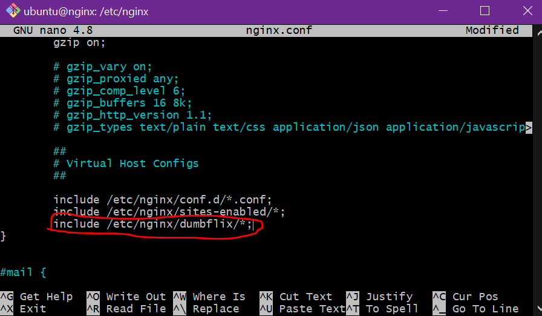
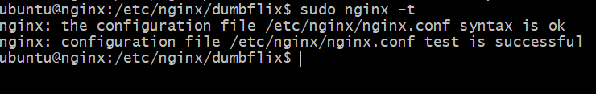
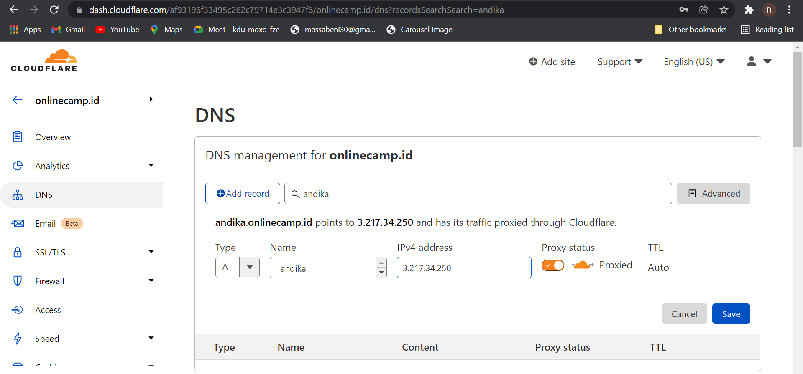

# Reverse Proxy AWS
Pada Pembahasan ini kita akan membahas langkah- langkah reverse proxy dengan server dari AWS kita, berikut langkah-langkahnya:

  ### step 1
* pertama kita masuk ke instance nginx kita yang sudah kita buat tadi dengan cara 
* buka terminal lalu tuliskan perintah `ssh -I nama_file_ssh ubuntu@ip address aws`

  
  
  ### step 2
 * Kemudian kita masuk kedalam direktori /etc/nginx `cd /etc/nginx`
 * Lalu buat direktori dumbflix dan kita masuk kedalam direktori dumbflix
  
  
  
  ### step 3
 * Lalu buat file didalam direktori dumbflix dengan perintah `sudo nano andika.onlinecamp.id`
 * Didalamnya kita bisa isikan seperti gambar dibawah
 
   
   
   ### step 4
  * Setelah selesai kita bisa klik `ctrl + x` lalu tekan y dan `enter`
  * Kemudian mundur satu direktori
  * Lalu kita edit file nginx.conf `sudo nano nginx.conf` ini berguna untuk memberi akses lokasi kepada direktori dan file yang barusan kita buat

    
    
    ### step 5
   * Setelah selesai kita bisa klik `ctrl + x` lalu tekan y dan `enter`
   * kemudian kita cek apakah ada kesalahan atau tidak dalam set confignya dengan `sudo nginx -t`
   
   
    
   ### step 6
   * Lalu reload nginx `sudo systemctl reload nginx`
   * Kemudian arahkan domain dengan ip publik server yg dipakai untuk reverse proxy `3.217.34.250`
    
   
   
   ### step 7
  * Jika sudah kita bisa akses dibrowser dengan `http://andika.onlinecamp.id/`

   
  

   

