# Setup server AWS for frontend
    Pada Pembahasan ini kita akan membahas bagaimana cara mengcreate dan mensetup server di AWS, berikut langkah-langkahnya:
    
### step 1
* Pertama kita login ke awseducate.com dan masuk ke akun kalian, dan jika sudah berhasil maka akan tampil halaman berikut

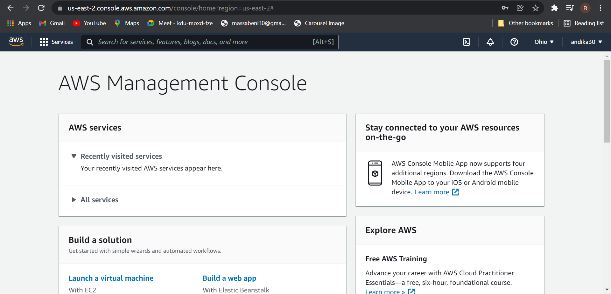

### step 2
* Langkah selanjut nya yaitu kita membuat  instance EC2 nya dengan masuk ke menu dashboard EC2
* selanjutnya pilih instance >> pilih launch instance

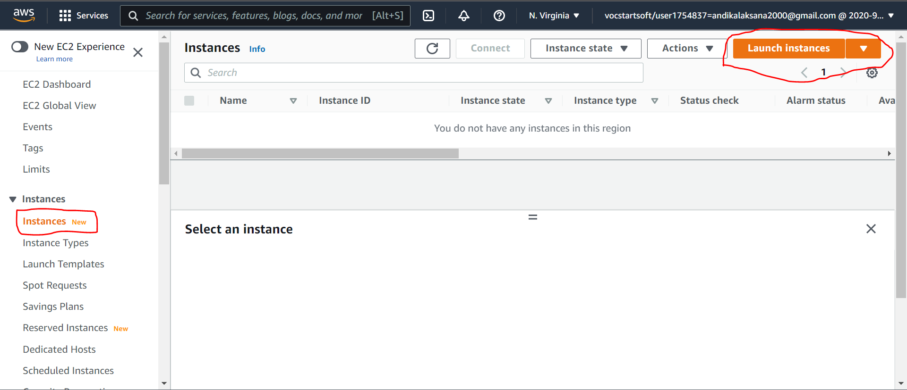

### step 3
* setelah itu pilih OS yang mau kita gunakan, di sini saya menggunakan ubuntu 20 lts
* jika sudah selesai klik select

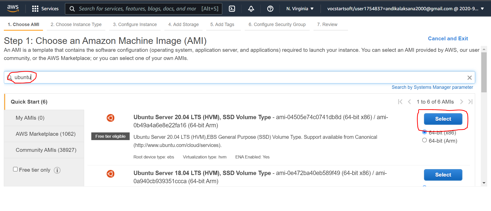

### step 4
* kemudian pada bagian Choose an Instance Type pilih t2 micro, atau sesuai kan kebutuhan anda
* jika sudah, pilih next config

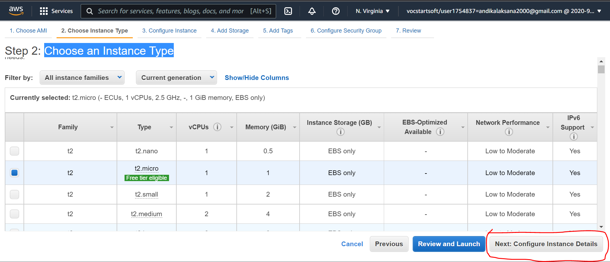

### step 5
* Pada bagian configure instance detail kita atur Auto-assign Public IP disable karena kita menggunakan ip static
* setelah itu klik next config

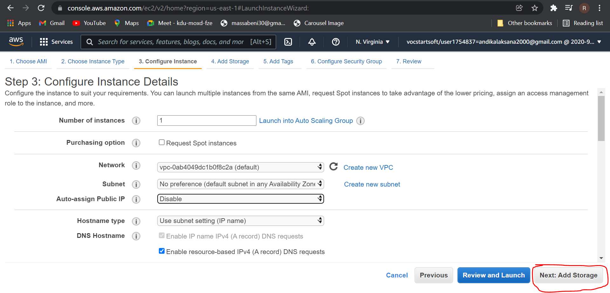

### step 6
* pada bagian add storage, pilih sesuai kebutuhan anda dan jika sudah sesuai klik next config

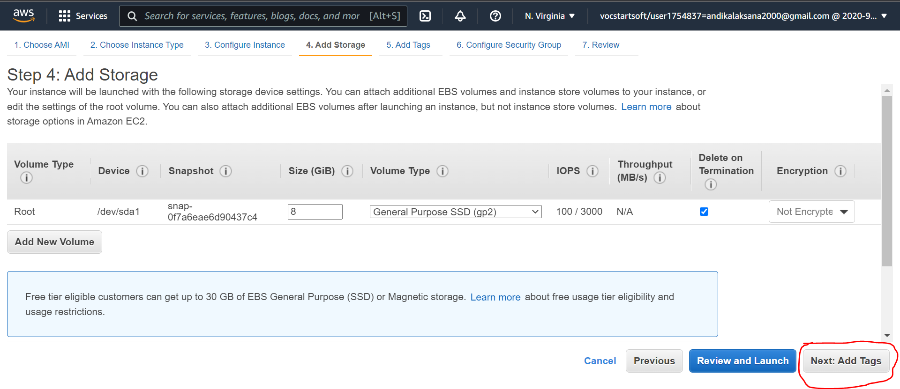

### step 7
* pada bagian add tag klik next untuk melanjutkan

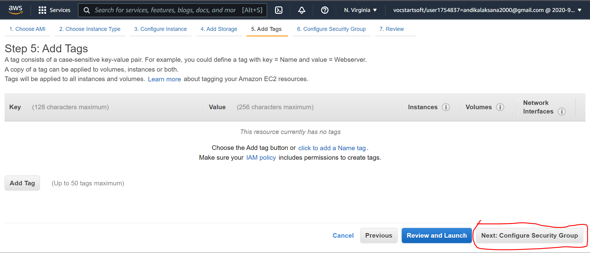

### step 8
* pada bagian configure security group kita pilih settingan yang all traffic agar apps kita bisa di akses dari mana saja
* setelah itu klik review and launch

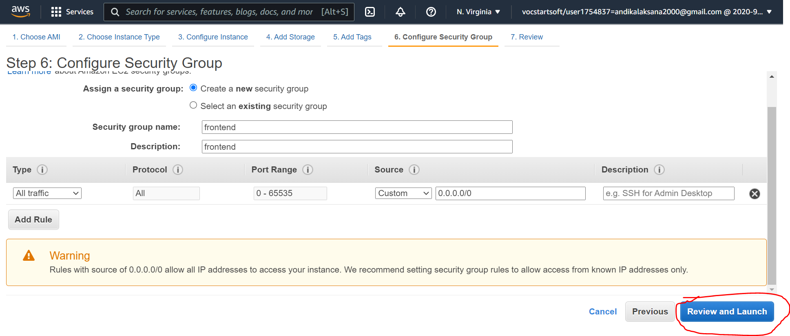

### step 9
* pada bagian ini silahkan klik launch

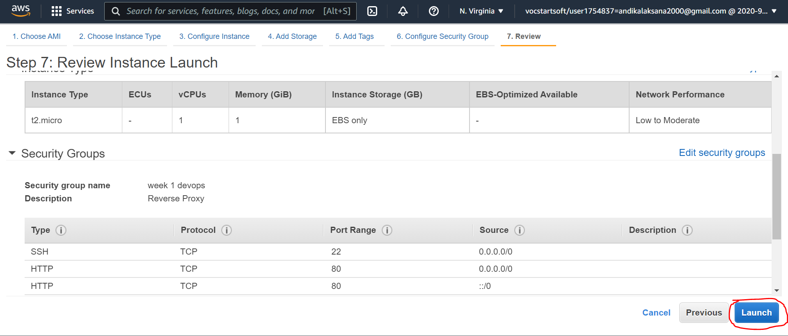

### step 10
* pada bagian ini pilih create new key pair, dan beri nama sesuai kebutuhan anda
* kemudian klik download key pair

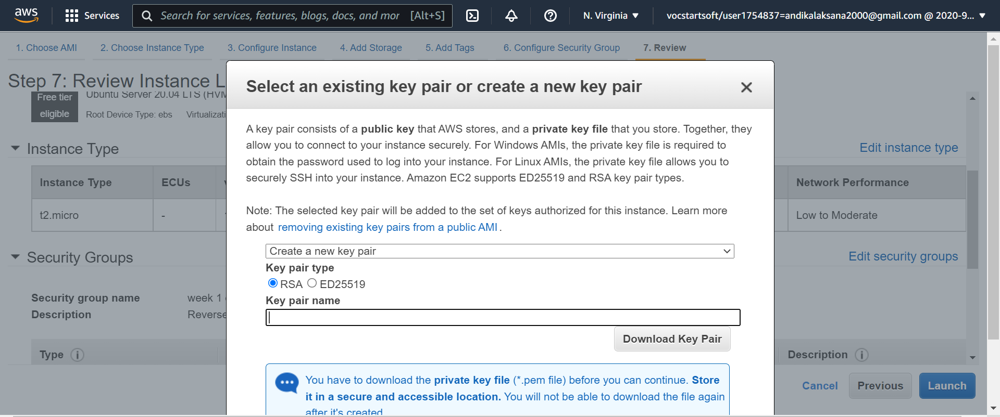

### step 11
* jika telah berhasil maka akan tampil seperti berikut

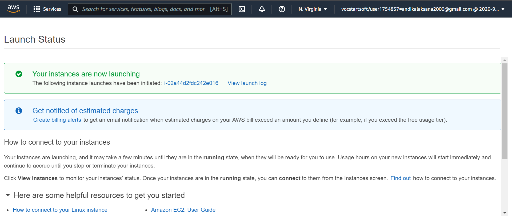

## Setup Elastic Ips

### step 1
* pada bagian network & security, pilih elastic Ips

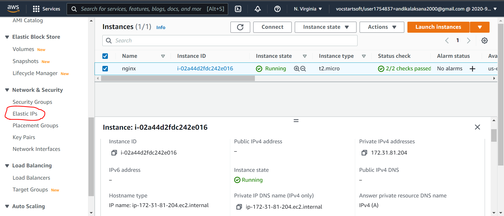

### step 2
* Kemudian pilih alocate elastic ip

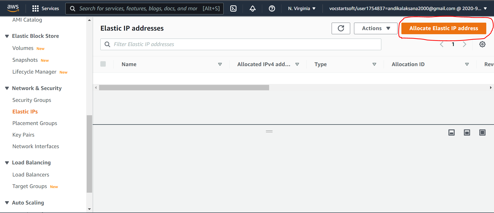

### step 3
* pada bagian ini langsung klik allocate saja untuk melanjutkan

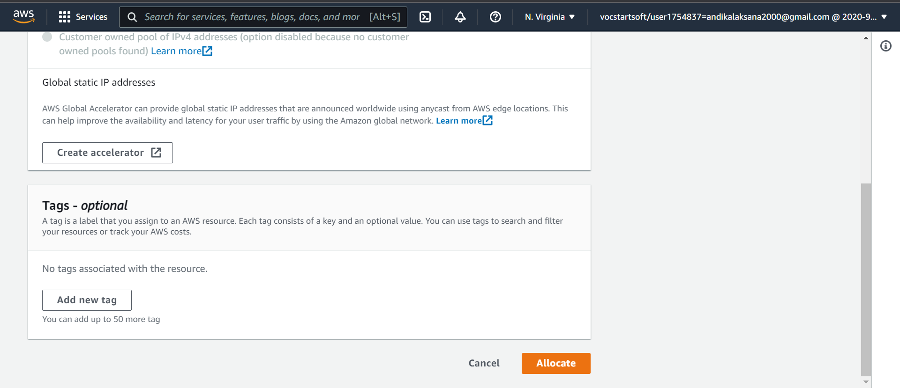

### step 4
* setelah itu kita associate ip kita dengan cara klik action >> pilih associate elastic ip address

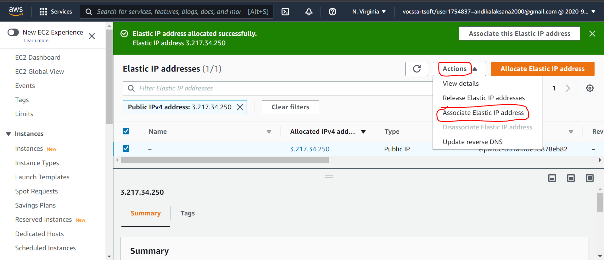

### step 5
* setelah itu kita pilih instance kita >> kemudian klik associate

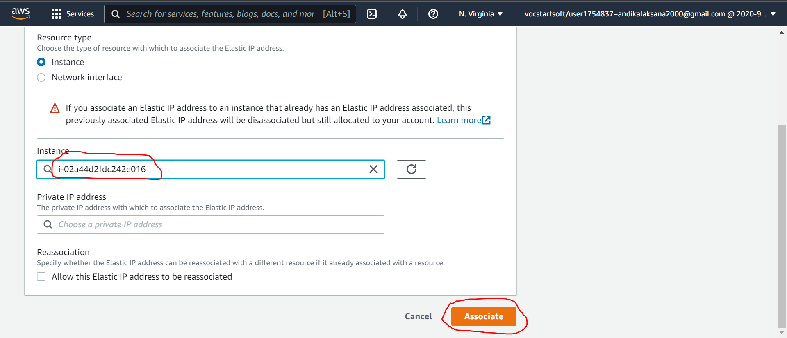

### step 6
* jika telah berhasil maka akan tampil seperti gambar berikut 

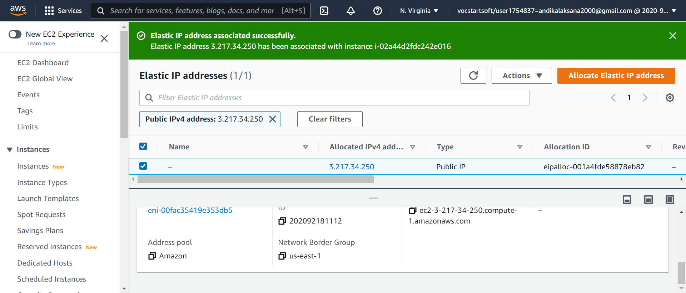

## Connect to server aws with ssh key

### step 1
* masuk ke folder penyimpanan ssh key yang sudah kita download tadi
* kemudian ketikan perintah berikut `ssh -I dumbflix.pem ubuntu@ip public`

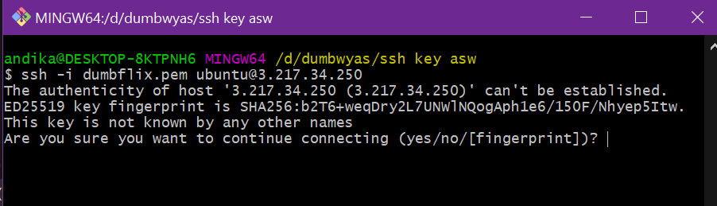

### step 2
* jika sudah berhasil masuk maka akan tampil seperti berikut

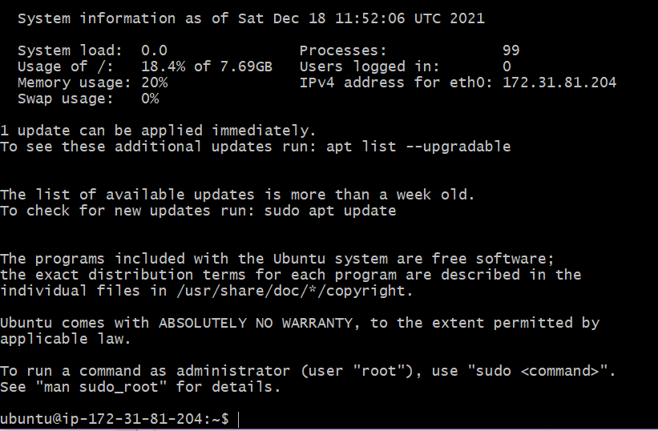

### step 3
* Langkah selanjutnya yaitu kita update dan upgrade server kita dengan mengetikan perintah berikut `sudo apt update`
* `sudo apt upgrade`

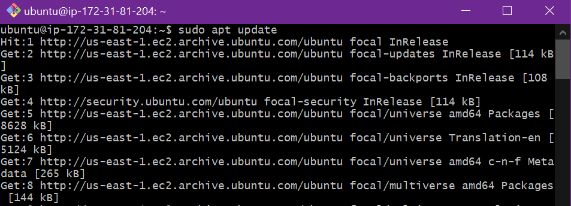

## Install Aplication on server AWS

### step 1
* install nvm terlebih dahulu dengan mengetikan perintah berikut `curl https://raw.githubusercontent.com/creationix/nvm/master/install.sh | bash`

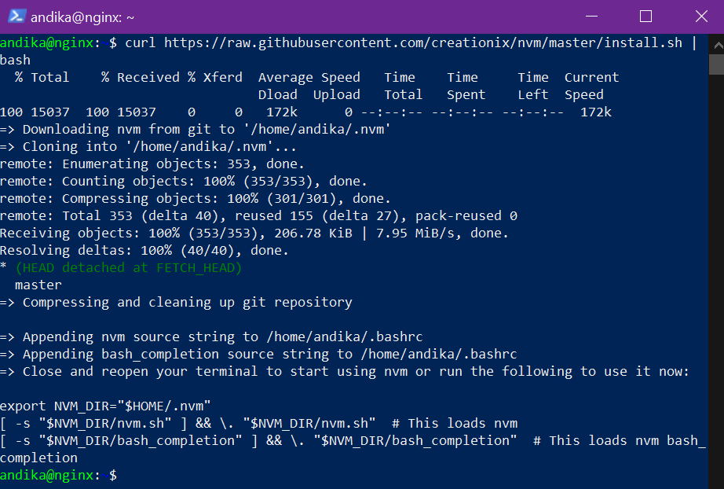

### step 2
* setelah itu kita Muat ulang lingkungan sistem menggunakan perintah ini `source ~/.profile`

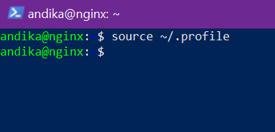

### step 3
* instal versi node.js yang perlu Anda gunakan dengan perintah `nvm install 14` dan nvm sudah berhasil terpasangan di server kita

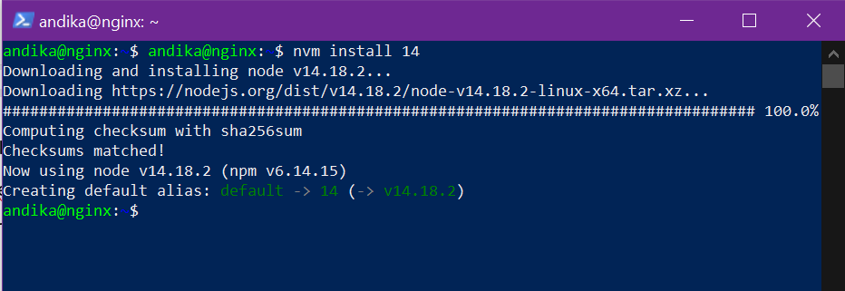

### step 4
* langkah selanjutnya yaitu kita install dependencies yang di butuhkan oleh aplikasi dengan perintah berikut, masuk de directory aplikasi 
* kemudian tuliskan perintah `npm install`

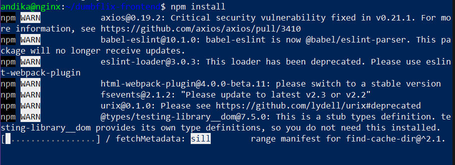

### step 5
* jika sudah selesai, setelah itu run apps kita dengan perintah `npm start`
* dan sekarang apps kita sudah bisa di akses melalui port 3000, berikut tampilan nya

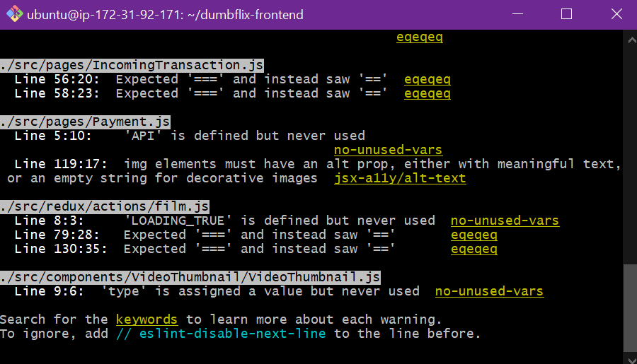

  
