# Install Aplikasi Frontend dan Reverse Proxy
Pada Pembahasan ini kita akan membahas bagaimana cara menginstall aplikasi kedalam linux server kita yang ada di VMWare dan membahas langkah-langkah pembuatan reverse proxy.

    jika kita belum install nginx maka kita install terlebih dahulu dengan perintah berikut `sudo apt install nginx`
    
### step 1
* Setelah itu Install dengan jalankan perintah berikut `curl https://raw.githubusercontent.com/creationix/nvm/master/install.sh | bash`

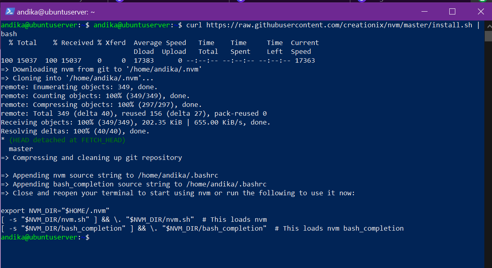

### step 2
* Atur variable lingkungan dengan perintah berikut `source ~/.profile`

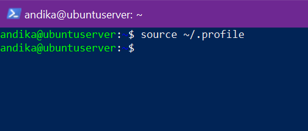

### step 3
* Install nodejs nya dengan perintah berikut `nvm install 14`
* setelah berhasil install nvm nya, selanjutnya Clone github aplikasi dumbflix dari repositori git hub dengan perintah `git clone https://github.com/sgnd/dumbflix-frontend.git`
* setelah itu kita Install PM2 agar saat kita menutup terminal kita aplikasi tidak ikut mati, cara install nya dengan perintah berikut `npm install pm2@latest -g`

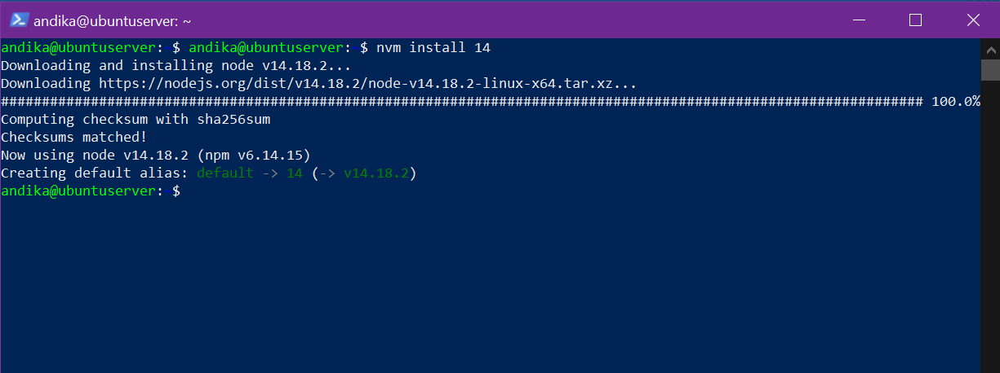

### step 4
* masuk ke direktori aplikasi nya dengan perintah `cd nama_dir`
* kemudian buat file ecosystem nya dengan perintah `pm2 ecosystem simple`

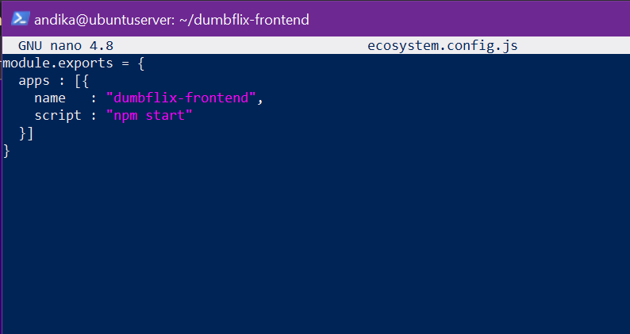

### step 5
* Jalankan npm install terlebih dahulu unutk download dependencies nya `npm install`

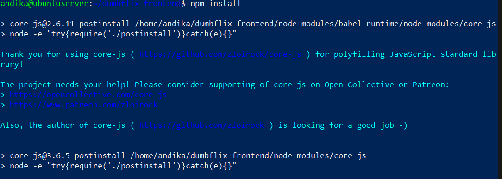

### step 6
* Kemudian jalankan aplikasi nya dengan perintah berikut `pm2 start nama_file_ecosystem`

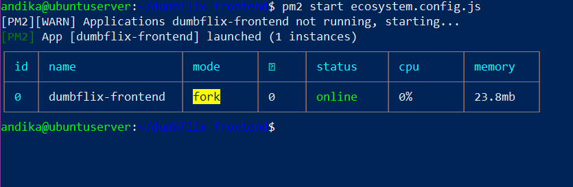

### step 7
* Dan jika berhasil maka akan tampil seperti berikut

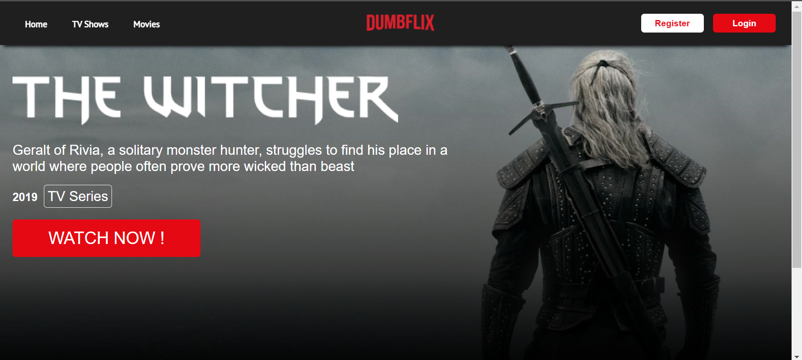

## Reverse Proxy

    Setelah kita berhasil deploy dumbflix frontend ke server nginx kita, Langkah selanjut nya yaitu kita membuat reverse proxy nya berikut Langkah Langkah nya :
    
### step 1
* Masuk ke direktori `cd /etc/nginx` dan buat sebuah folder baru di dalam direktori tsb

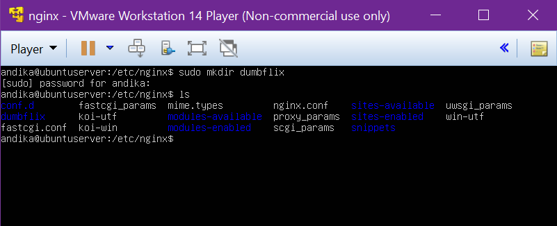

### step 2
* Buka nginx.conf dan tambahkan `include /etc/nginx/dumbflix/*` 
* Setelah itu save

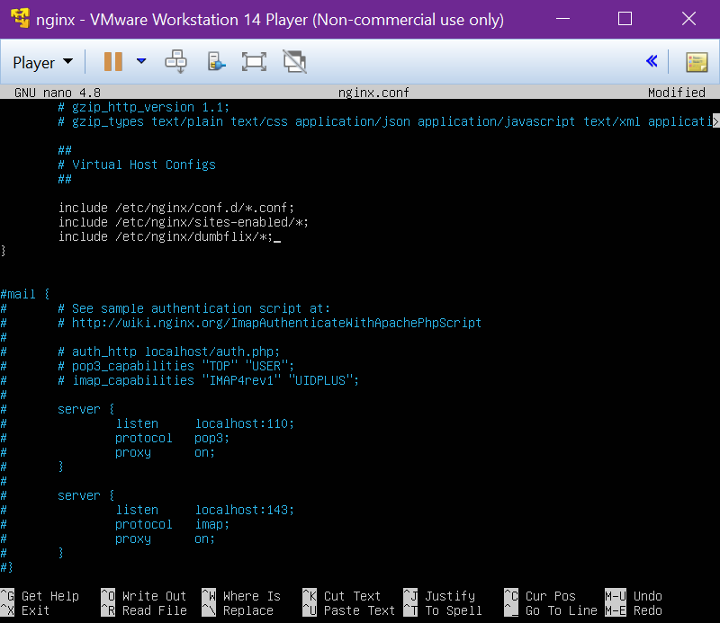

### step 3
* Masuk ke direktori `cd /etc/nginx` dan buat sebuah folder baru di dalam direktori tsb

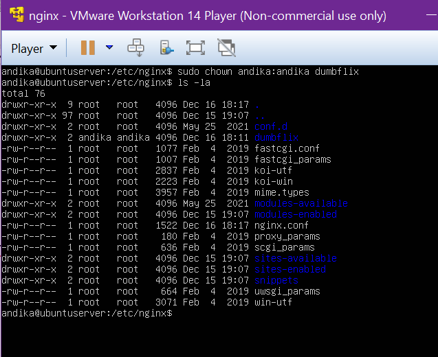

### step 4
* Kemudian buat file dengan nama domain kalian ` nano nama_domain`
* Kemudian masukkan blok kode seperti gambar di bawah
* Kemudian save dan jalankan perintah `sudo nano nginx -t`

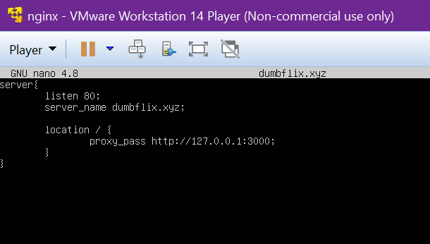

### step 5
* Buat domain local dengan cara edit file /etc/hosts nya dengan perintah berikut `sudo nano /etc/hosts`
* Pada baris terakhir tambahkan IP address server kalian dan nama domain local kalian
* Kemudian reload nginx kalian dengan perintah `sudo systemctl reload nginx`

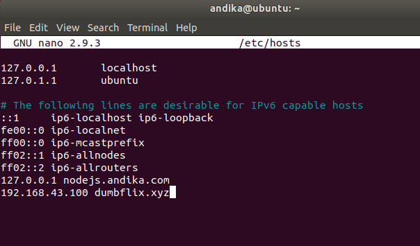

### step 6
* Jalankan aplikasi dumbflix nya menggunakan pm2

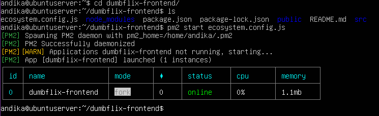

### step 7
* Jika berhasil maka akan tampil seperti berikut

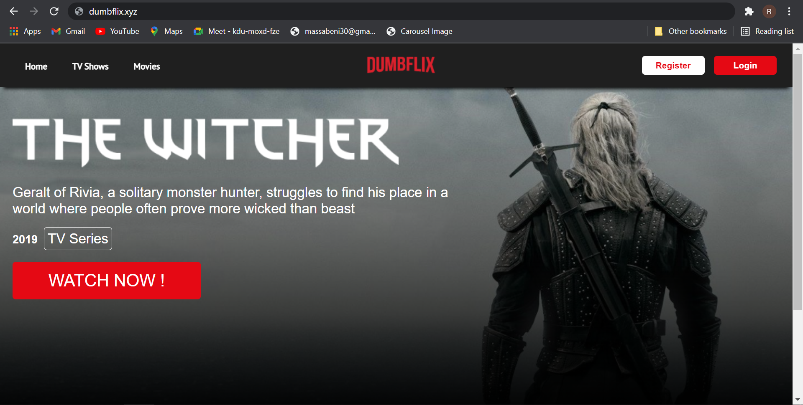

