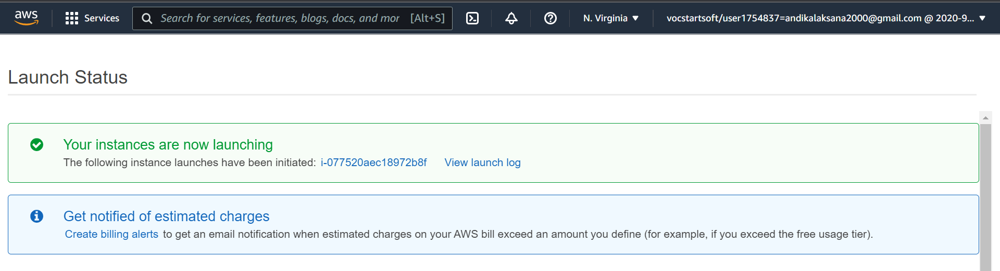
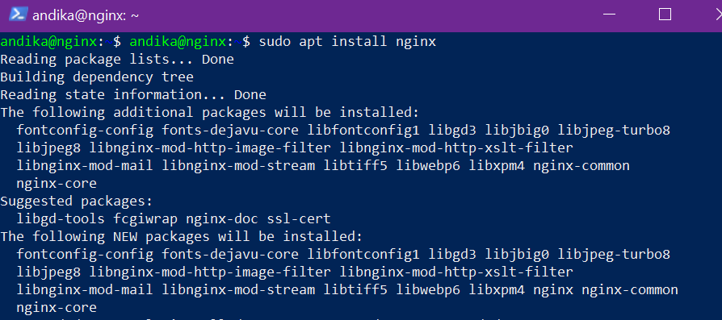

# Setup server AWS for nginx
Pada Pembahasan ini kita akan membahas langkah-langkah setup server nginx di aws, berikut langkah-langkahnya:

### step 1
* pertama kita buat instance baru di aws seperti yang sudah di jelaskan tadi
* jika sudah berhasil membuat instance nya maka akan tampil seperti berikut

### step 2
- jika sudah berhasil membuat instance baru, maka selanjutnya install nginx nya dengan perintah berikut ` sudo apt install nginx`

