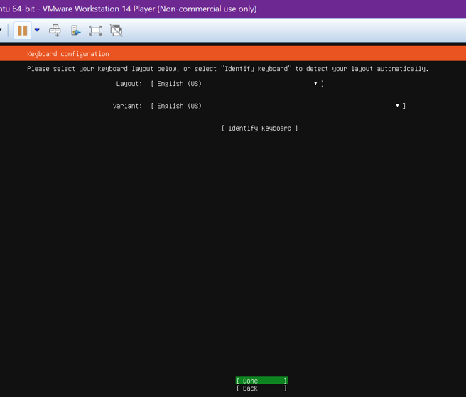

# Installasi Linux Ubuntu Server di VMWare
Berikut adalah proses installasi Ubuntu Server di VMWare:

### step 1
* buka aplikasi VMWare yang telah di  download tadi, dan pilih create new  virtual mechine

### step 2
* setelah itu akan muncul tampilan  wizard, dan anda di minta untuk  mengisikan username dan password  untuk log in ke server nya, setelah itu  klik next

### step 3
* setelah itu akan muncul tampilan  wizard, dan anda di minta untuk  mengisikan username dan password  untuk log in ke server nya, setelah itu  klik next

### step 4
* tentukan alokasi penyimpanan  ubuntu, di sini saya menggunakan  20 Gb atau rekomendasi dari  VMWare nya, setelah itu klik next

### step 5
* akan muncul informasi tentang  mesin virtual kita seperti hardisk,  memory/ram, setelah itu klik finish

### step 6
* setelah itu kita akan di arahkan ke  installasi ubuntu server, setelah itu  pilih bahasa nya, lalu tekan enter

### step 7
* setelah itu pilih bahasa keyboard  anda, dan tekan done untuk  melanjutkan

### step 8
* setelah itu kita setting networking  nya, karena kita menggunakan  static IP maka kita harus setup  manual IP Address nya dengan cara  pilih edit IPv4 dan tekan enter untuk  melanjutkan

### step 9
* setelah itu pilih manual dan tekan  enter untuk melanjutkan

### step 10
* akan muncul tampilan seperti  berikut, setelah itu masukkan ip  address anda dan klik done untuk  melanjutkan

### step 11
* setelah itu akan muncul tampilan  seperti di gambar, pilih custom  layout, lalu klik done

### step 12
lalu kita akan di arahkan ke window  pengaturan penyimpanan seperti  gambar berikut, setelah itu klik enter  pada partisi tersebut dan atur sesuai  dengan konfigurasi di VMWare di sini  saya menggunkan :

2 Gb Ram
dan sisa nya untuk pratisi root ( / )

jika sudah selesai klik done untuk  melanjutkan

### step 13
* setelah itu akan muncul tampilan  seperti berikut, isikan username dan  password dari ubuntu server anda  setalah itu klik done untuk melanjutkan

### step 14
* setelah itu pilih install OpenSSH server  agar kita bisa meremote server kita  kemudian tekan done untuk  melanjutkan

### step 15
* tunggu proses installasi selesai, setelah  itu jika muncul tulisan reboot now, pilih  reboot now untuk merestart virtual  mechine dan tunggu hingga proses  selesai
* dan jika sudah berhasil, maka akan tampil seperti gambar berikut

